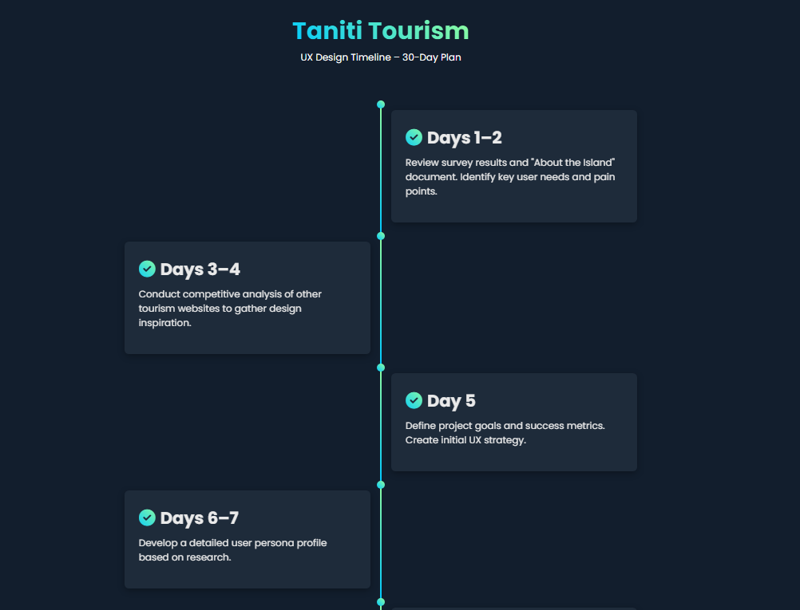

# Project Timeline – Taniti Tourism Website

This timeline outlines the 4-week plan for designing and launching the Taniti Tourism website. It includes stages for research, design, testing, and final delivery.

## Timeline Overview

- **Total Duration**: 1 month
- **Sections**: Research, Design, Testing, Finalization
- **Tools Used**: HTML, CSS, optional JavaScript for interactivity

## Features

- Vertical timeline layout
- Mobile-friendly design
- Easy to edit and extend
- Organized by day and week for clear project tracking

## How to Use

1. Open `timeline.html` in a browser to view the timeline
2. Update the days or tasks as your project evolves
3. Customize the styling in `style.css` if needed

## Files

- `timeline.html` – the full timeline layout
- `style.css` – timeline styling (optional if included inline)
- `README.md` – this file

> Tip: You can embed the timeline into your case study or portfolio to show your UX process.
